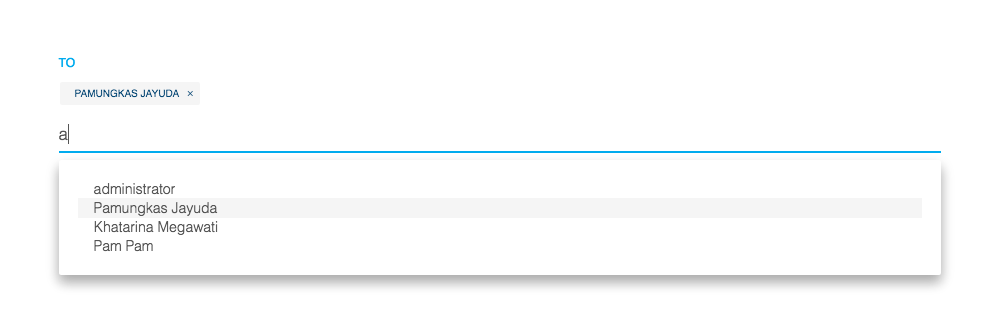

# flx-autocomplate

## Install
add jayuda:flx-autocomplate to your project

## Usage

### DONT FORGET TO SUBSCRIBTIONS

### USE IT IN HTML
```html
<input  class='form-control' id="searchBox" type="search" list="XXXX">
<datalist id="XXXX">
    {{#each datasearchBox}}
        <option value="{{NAMEField}}"></option>
    {{/each}}
</datalist>


```


### ADD In Helper
```javascript
Template.YOURTEMPLATE.helpers({
    datasearchBox: function () {
        return Session.get('searchBox');    // Name parameter
    },
});

Template.YOURTEMPLATE.events({
    'keyup input#searchBox': function () {
        flxautocomplate.autocomplete({
            name: 'searchBox',              // Name parameter
            element: 'input#searchBox',
            collection: NAMECOLLECTIONS,
            field: ['NAMEField_1', 'NAMEField_2'], // All this field will find with $or
            limit: 0,
            sort: { NAMEField: 1 },
            filter: {}
        });
    },
});

```
